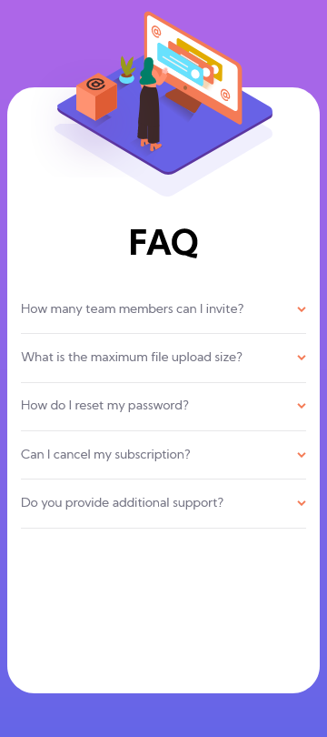

# Frontend Mentor - FAQ accordion card solution

This is a solution to the [FAQ accordion card challenge on Frontend Mentor](https://www.frontendmentor.io/challenges/faq-accordion-card-XlyjD0Oam). Frontend Mentor challenges help you improve your coding skills by building realistic projects.

## Table of contents

- [Overview](#overview)
  - [The challenge](#the-challenge)
  - [Screenshot](#screenshot)
  - [Links](#links)
  - [Built with](#built-with)
  - [What I learned](#what-i-learned)
  - [Useful resources](#useful-resources)
- [Author](#author)

## Overview

I found this interesting challenge on frontendmentor.io and tried this to test my CSS and JavaScript knowledge.

### The challenge

Users should be able to:

- View the optimal layout for the component depending on their device's screen size
- See hover states for all interactive elements on the page
- Hide/Show the answer to a question when the question is clicked

### Screenshot

### Links

- Solution URL: [Github](https://github.com/pranto-bapary/faq-accordion-card)
- Live Site URL: [Github Pages](https://pranto-bapary.github.io/faq-accordion-card)

### Built with

- HTML 5
- CSS 3
- CSS Grid
- Mobile-first workflow
- [Google Fonts](https://fonts.google.com) - For Custom Font

### What I learned

By doing this challenge I've learned CSS Grid properly as well as Responsive Design/

### Useful resources

- [W3schools](https://www.w3schools.com) - This helped me for learning CSS Grid and Responsive Design properly.

## Author

- Website - [Pranto Bapary](https://github.com/pranto-bapary)
